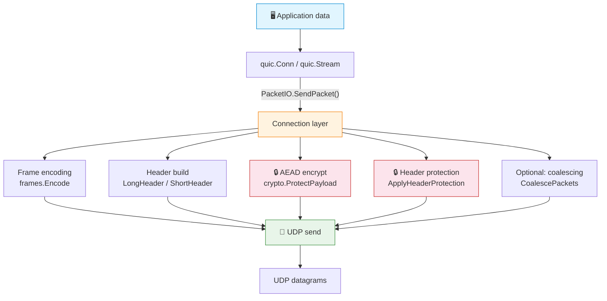

# 🚀 QUIC Transport Protocol - Go Implementation

> RFC 9000 · RFC 9001 · RFC 9002 — a from-scratch, learning-oriented QUIC in pure Go.

**[English](README.md)** | **[中文](README.zh-CN.md)**


-success)


A Go implementation of the core QUIC transport protocol as specified in [RFC 9000](https://www.rfc-editor.org/rfc/rfc9000) (Transport), [RFC 9001](https://www.rfc-editor.org/rfc/rfc9001) (Using TLS to Secure QUIC), and [RFC 9002](https://www.rfc-editor.org/rfc/rfc9002) (Loss Detection and Congestion Control), including a high-level `quic` package for building servers and clients.

## 📋 Overview

This project implements the fundamental building blocks of the QUIC transport protocol, including:

- **🔢 Variable-Length Integer Encoding** (Section 16) — QUIC's custom varint format (6/14/30/62-bit)
- **📦 Packet Number Encoding/Decoding** (Section 17.1) — Truncated packet number encoding with Appendix A pseudocode
- **Frame Types** (Section 19) — All frame types defined in RFC 9000 §19 (0x00–0x1e): PADDING, PING, ACK (with ECN variant), RESET_STREAM, STOP_SENDING, CRYPTO, NEW_TOKEN, STREAM (0x08–0x0f), MAX_DATA, MAX_STREAM_DATA, MAX_STREAMS (bidi/uni), DATA_BLOCKED, STREAM_DATA_BLOCKED, STREAMS_BLOCKED (bidi/uni), NEW_CONNECTION_ID, RETIRE_CONNECTION_ID, PATH_CHALLENGE, PATH_RESPONSE, CONNECTION_CLOSE (transport/application), HANDSHAKE_DONE
- **Packet Headers** (Section 17) — Long headers (Initial, 0-RTT, Handshake, Retry), short headers (1-RTT), and Version Negotiation
- **Transport Parameters** (Section 18) — Full encoding/decoding of all 17 transport parameters
- **Connection ID Management** (Section 5.1) — CID generation, retirement, and stateless reset tokens
- **Stream Management** (Sections 2-4) — Bidirectional/unidirectional streams, stream state machines, flow control
- **Error Codes** (Section 20) — All transport error codes
- **Connection State Machine** (Sections 5, 10) — Lifecycle, packet routing, idle timeout, close/draining
- **ACK Tracking** (Section 13) — Received packet set tracking, ACK range generation
- **Path Validation & Migration** (Sections 8-9) — PATH_CHALLENGE/RESPONSE, anti-amplification
- **Token Management** (Section 8) — Address validation tokens, Retry integrity tag
- **Packet Coalescing** (Section 12.4) — Multi-packet UDP datagram merging/splitting
- **Version Negotiation** (Section 6) — VN packet generation and handling
- **PMTU Discovery** (Section 14) — DPLPMTUD binary search probing
- **Packet Protection** (RFC 9001 §5) — AEAD encryption/decryption (AES-128-GCM, AES-256-GCM), header protection (AES-ECB mask)
- **Key Derivation** (RFC 9001 §5.1-5.2) — HKDF-Expand-Label, initial secrets from DCID, traffic key/IV/HP derivation, key update
- **TLS 1.3 Integration** (RFC 9001 §4) — CRYPTO frame data routing, encryption level management, handshake state tracking via Go crypto/tls QUICConn
- **Key Update & Key Phase** (RFC 9001 §6) — Key phase bit toggle, old key retention, AEAD usage limits
- **RTT Estimation** (RFC 9002 §5) — smoothed_rtt, rttvar, min_rtt, ack delay handling
- **Loss Detection** (RFC 9002 §6) — Packet threshold (kPacketThreshold=3), time threshold (9/8 RTT), PTO calculation & backoff, multi-modal loss detection timer
- **Congestion Control** (RFC 9002 §7) — NewReno-like: slow start, congestion avoidance, recovery period, ECN, persistent congestion

> HTTP/3 is implemented in a separate companion module (`http3-go`), not in this repo. See that module's README for the HTTP/3 + QPACK API and `cmd/demo`.

## 🛠️ API Usage

The root `quic` package provides a high-level API inspired by Go's `net` package:

### 🖥️ Server

```go
listener, err := quic.Listen("udp", "127.0.0.1:4433", nil)
if err != nil {
    log.Fatal(err)
}
defer listener.Close()

for {
    conn, err := listener.Accept()
    if err != nil {
        log.Fatal(err)
    }
    go handleConn(conn)
}

func handleConn(conn *quic.Conn) {
    defer conn.Close()
    for {
        stream, err := conn.AcceptStream()
        if err != nil {
            return
        }
        go handleStream(stream)
    }
}
```

### 📡 Client

```go
conn, err := quic.Dial("udp", "127.0.0.1:4433", nil)
if err != nil {
    log.Fatal(err)
}
defer conn.Close()

stream, err := conn.OpenStream()
if err != nil {
    log.Fatal(err)
}
stream.Write([]byte("Hello QUIC!"))

buf := make([]byte, 1024)
n, _ := stream.Read(buf)
fmt.Println(string(buf[:n]))
```

### ⚙️ Config

```go
config := &quic.Config{
    MaxIdleTimeout:     30 * time.Second,
    MaxStreamData:      1 << 20,  // 1 MiB per stream
    MaxConnectionData:  10 << 20, // 10 MiB per connection
    MaxStreamsBidi:     100,
    MaxStreamsUni:      100,
    ConnIDLength:       8,
}
```

## 🔐 TLS Quick Start

The SDK supports full TLS 1.3 encryption (RFC 9001) via `Config.TLSMode`. This section covers everything from running the built-in demo to writing your own TLS server and client.

### ✅ Requirements

- Go 1.26+ (uses the `crypto/tls` QUICConn API)
- No external dependencies (Go standard library only)

### ▶️ Run the Demo

The project ships a TLS echo demo (`cmd/tls-demo/`) that generates a self-signed certificate in memory and completes the TLS handshake:

```bash
# Terminal 1: start the TLS server
cd quic-go && go run ./cmd/tls-demo -server -addr 127.0.0.1:8443

# Terminal 2: run the TLS client
cd quic-go && go run ./cmd/tls-demo -addr 127.0.0.1:8443
```

Expected output:

```
# Server
QUIC TLS server listening on 127.0.0.1:8443
TLS 1.3 + QUIC packet protection enabled
Waiting for connections...
connection from 127.0.0.1:xxxxx
server received: "hello over QUIC+TLS"

# Client
Dialing 127.0.0.1:8443 with QUIC+TLS...
TLS handshake complete, connection established
client sending: "hello over QUIC+TLS"
client received: "echo: hello over QUIC+TLS"
Demo complete!
```

### 📖 TLS Mode API Overview

The SDK API mirrors Go's standard `net` package — set `TLSMode: true` in `Config` to enable TLS:

```go
import "github.com/Cabbage4/quic-go"

config := &quic.Config{
    TLSMode:           true,              // Enable TLS 1.3
    TLSCertificates:   []tls.Certificate{cert},  // Server cert (not needed on client)
    ServerName:        "example.com",     // Client SNI (client only)
    InsecureSkipVerify: false,            // Skip cert verification on client
    ALPNProtocols:     []string{"h3"},    // ALPN protocol list

    // Common config
    MaxIdleTimeout:    30 * time.Second,
    MaxStreamData:     1 << 20,   // 1 MiB
    MaxConnectionData: 10 << 20,  // 10 MiB
    MaxStreamsBidi:    100,
    MaxStreamsUni:     100,
    ConnIDLength:      8,
}
```

#### TLS-related Config fields

| Field | Type | Server | Client | Description |
|------|------|--------|--------|------|
| `TLSMode` | `bool` | required | required | `true` enables TLS 1.3; `false` uses plaintext |
| `TLSCertificates` | `[]tls.Certificate` | required | not needed | Server TLS certificates |
| `ALPNProtocols` | `[]string` | optional | optional | ALPN negotiation list |
| `ServerName` | `string` | not needed | optional | Client SNI (should match cert hostname) |
| `InsecureSkipVerify` | `bool` | not needed | optional | Skip cert verification (test only) |

### 🖥️ Server Usage

```go
package main

import (
    "crypto/tls"
    "log"
    "time"

    "github.com/Cabbage4/quic-go"
)

func main() {
    // Load certificate (in production, load from files)
    cert, err := tls.LoadX509KeyPair("server.crt", "server.key")
    if err != nil {
        log.Fatal(err)
    }

    config := &quic.Config{
        TLSMode:         true,
        TLSCertificates: []tls.Certificate{cert},
        ALPNProtocols:   []string{"myapp"},
        MaxIdleTimeout:  30 * time.Second,
        ConnIDLength:    8,
    }

    listener, err := quic.Listen("udp", "0.0.0.0:443", config)
    if err != nil {
        log.Fatal(err)
    }
    defer listener.Close()

    for {
        conn, err := listener.Accept()
        if err != nil {
            log.Println(err)
            continue
        }
        go handleConnection(conn)
    }
}

func handleConnection(conn *quic.Conn) {
    defer conn.Close()
    for {
        stream, err := conn.AcceptStream()
        if err != nil {
            return
        }
        go handleStream(stream)
    }
}

func handleStream(stream *quic.Stream) {
    defer stream.Close()
    buf := make([]byte, 4096)
    for {
        n, err := stream.Read(buf)
        if err != nil {
            return
        }
        stream.Write(buf[:n]) // echo
    }
}
```

### 📡 Client Usage

```go
package main

import (
    "log"
    "time"

    "github.com/Cabbage4/quic-go"
)

func main() {
    config := &quic.Config{
        TLSMode:            true,
        ServerName:         "example.com",
        ALPNProtocols:      []string{"myapp"},
        MaxIdleTimeout:     30 * time.Second,
        ConnIDLength:       8,
        InsecureSkipVerify: true, // Skip cert verification in tests; configure RootCAs in production
    }

    conn, err := quic.Dial("udp", "example.com:443", config)
    if err != nil {
        log.Fatal(err)
    }
    defer conn.Close()

    // The TLS handshake is driven automatically during Dial
    // Open a bidirectional stream and send data
    stream, err := conn.OpenStream()
    if err != nil {
        log.Fatal(err)
    }
    defer stream.Close()

    stream.Write([]byte("hello QUIC+TLS"))

    buf := make([]byte, 4096)
    n, _ := stream.Read(buf)
    log.Printf("received: %s", buf[:n])
}
```

### 🔓 Plaintext Mode (for Debugging)

Set `TLSMode` to `false` (or leave it unset) to use plaintext mode, where packets are not encrypted — useful for protocol learning and debugging:

```go
config := &quic.Config{
    // TLSMode: false (default — no need to set explicitly)
    MaxIdleTimeout: 30 * time.Second,
    ConnIDLength:   8,
}

// Server
listener, _ := quic.Listen("udp", "127.0.0.1:8443", config)

// Client
conn, _ := quic.Dial("udp", "127.0.0.1:8443", config)
```

### 🔄 TLS vs Plaintext

| Feature | Plaintext (`TLSMode: false`) | TLS (`TLSMode: true`) |
|------|-----|-----|
| Data encryption | None | AES-128-GCM / AES-256-GCM |
| Header protection | None | AES-ECB mask (RFC 9001 §5.4) |
| Handshake | PING → HANDSHAKE_DONE (simplified) | TLS 1.3 ClientHello → ServerHello → Finished |
| Certificates | Not required | Required (server must; client optional for mTLS) |
| Transport params | Exchanged via Initial frames | Exchanged via TLS extension |
| Key update | Not supported | Supported (RFC 9001 §6 Key Update) |
| Use case | Dev/debug, protocol learning | Production, secure communication |

## 🏗️ Architecture

In TLS mode, data flows through this pipeline:



<details>
<summary>📄 Text version</summary>

```
Application data
    ↓
quic.Conn / quic.Stream
    ↓ calls PacketIO.SendPacket()
Connection layer
    ├── Frame encoding (frames.Encode)
    ├── Header build (header.LongHeader / ShortHeader)
    ├── AEAD encrypt (crypto.ProtectPayload)
    ├── Header protection (crypto.ApplyHeaderProtection)
    ├── Optional: packet coalescing (coalesce.CoalescePackets)
    └── UDP send
    ↓
UDP datagrams
```

</details>

Handshake flow:

```
Client                                     Server
  │                                          │
  ├── Initial [CRYPTO: ClientHello] ────────→│
  │                                          │ (DeriveInitialKeys)
  │                                          │ (StartTLS → process ClientHello)
  │←─── Initial [CRYPTO: ServerHello] ───────┤
  │←─── Handshake [CRYPTO: Cert, Finished] ──┤
  │                                          │
  │ (process ServerHello)                    │
  │ (install Handshake keys)                 │
  │                                          │
  ├── Handshake [CRYPTO: Finished] ────────→│
  │                                          │ (handshake confirmed)
  │←──── 1-RTT [HANDSHAKE_DONE] ─────────────┤
  │                                          │
  │     Connection established, app data
  ├── 1-RTT [STREAM: data] ────────────────→│
  │←─── 1-RTT [STREAM: response] ───────────┤
```

Key components:

- **`crypto.TLSSession`** — wraps `crypto/tls.QUICConn`, drives the TLS event loop.
- **`connection.KeySetStore`** — manages keys per encryption level (Initial / Handshake / Application).
- **`connection.PacketIO`** — unified send/receive pipeline; switches between encrypted and plaintext paths via `plaintextMode`.
- **`connection.Coordinator`** — lifecycle orchestrator: drives TLS handshake, PN-space discard, key update.
- **`connection.FrameHandler`** — frame dispatcher; routes CRYPTO frames to `KeyStore.FeedCryptoData()`.

## 📁 Project Structure

```
quic-go/
├── go.mod
├── varint/           # Variable-length integer encoding (Section 16)
├── packet/           # Packet number encoding/decoding (Section 17.1)
├── frames/           # Frame type encoding/decoding (Section 19)
├── header/           # Packet header formats (Section 17)
├── transport/        # Transport parameters (Section 18)
├── connection/       # Connection lifecycle & CID management (Sections 5, 10)
│   ├── conn.go            # State machine, packet routing, idle timeout, close/draining
│   ├── connid.go          # Connection ID management (Section 5.1)
│   ├── crypto.go          # Per-level key store + packet protection pipeline (RFC 9001)
│   ├── recovery.go        # Loss detection + congestion control integration (RFC 9002)
│   ├── ack_handler.go     # Per-PN-space ACK tracker integration (Section 13)
│   ├── frame_handler.go   # Comprehensive frame processing dispatch (Section 19)
│   ├── packet_io.go       # Unified packet send/receive pipeline with protection
│   ├── coordinator.go     # Connection lifecycle orchestrator (handshake, key discard, close)
│   ├── integration_test.go # Integration tests
│   └── e2e_test.go        # End-to-end lifecycle tests
├── stream/           # Stream management & flow control (Sections 2-4)
├── errors/           # Error codes (Section 20)
├── ack/              # ACK tracking & generation (Section 13)
├── path/             # Path validation & migration (Sections 8-9)
├── token/            # Address validation tokens (Section 8)
├── coalesce/         # Packet coalescing (Section 12.4)
├── version/          # Version negotiation (Section 6)
├── pmtu/             # PMTU discovery (Section 14)
├── crypto/           # Packet protection & TLS integration (RFC 9001)
│   ├── keys.go       # HKDF-Expand-Label, initial secrets, traffic key derivation
│   ├── aead.go       # AEAD encrypt/decrypt (AES-128-GCM, AES-256-GCM)
│   ├── header_protection.go  # Header protection mask generation & apply/remove
│   ├── key_update.go # Key update & Key Phase management
│   ├── tls.go        # TLS 1.3 integration via crypto/tls QUICConn
│   └── crypto_test.go # Tests
├── recovery/         # Loss detection & congestion control (RFC 9002)
│   ├── loss_detection.go  # RTT estimation, PTO, loss detection algorithms
│   ├── congestion.go      # NewReno-like congestion control
│   └── recovery_test.go   # Tests
# High-level QUIC API (root package, was sdk/)
config.go     # Config, Listener, Conn, Stream types (root)


├── cmd/
│   ├── demo/         # Protocol-level interactive demo
│   ├── echo/         # SDK echo server/client example
│   └── tls-demo/     # SDK TLS echo demo (self-signed cert, AEAD encryption)
└── README.md
```

## ▶️ Running

```bash
# Run all tests
cd quic-go && go test ./...

# Run the SDK echo demo (terminal 1 — server)
cd quic-go && go run ./cmd/echo -server -addr 127.0.0.1:4433

# Run the SDK echo demo (terminal 2 — client)
cd quic-go && go run ./cmd/echo -addr 127.0.0.1:4433 -msg "Hello QUIC!"

# Run the TLS echo demo (terminal 1 — server)
cd quic-go && go run ./cmd/tls-demo -server -addr 127.0.0.1:8443

# Run the TLS echo demo (terminal 2 — client)
cd quic-go && go run ./cmd/tls-demo -addr 127.0.0.1:8443

# Run the protocol demo
cd quic-go && go run ./cmd/demo
```

## 🎯 Key Design Decisions

1. **Pure Go** — No external dependencies (standard library only).
2. **RFC 9000 Appendix A pseudocode** — The packet number encode/decode algorithms directly implement the pseudocode from Appendix A.2 and A.3.
3. **Network byte order** — All multi-byte integers use big-endian encoding.
4. **Test vectors** — Uses the RFC 9000 test vectors for validation (e.g., varint 0x25=37, 0x7bbd=15293).
5. **SDK uses connection-layer pipeline** — The SDK's `Conn` struct wires together all connection-layer subsystems via `initSubsystems()`: KeySetStore, AckHandler, RecoveryManager, stream.Manager, FrameHandler, and PacketIO. The SDK's `handleIncoming` dispatches incoming packet payloads through `FrameHandler.ProcessFrames()` (using `frames.Decode()` for all RFC 9000 §19 frame types) instead of inline frame parsing. A `Coordinator` orchestrates lifecycle transitions (handshake, PN space discard, key phase, connection close with draining).

6. **Connection Layer Integration** — The `connection/` package provides a complete integration layer that wires together crypto, recovery, ACK tracking, frame processing, packet I/O, and lifecycle coordination:
   - `crypto.go`: KeySetStore for per-encryption-level key management, packet protection pipeline (AEAD + header protection), TLS session management
   - `recovery.go`: RecoveryManager integrating loss detection + congestion control with packet send/recv hooks
   - `ack_handler.go`: Per-PN-space ACK trackers with ACK frame generation and parsing
   - `frame_handler.go`: Comprehensive frame dispatch using `frames.Decode()` for all RFC 9000 §19 frame types, PATH_CHALLENGE/RESPONSE queuing, RETIRE_CONNECTION_ID handling, sent-frame tracking for ACK-driven stream state updates
   - `packet_io.go`: Unified packet send/receive pipeline with protection, coalescing, PN truncation/reconstruction, key phase bit wiring, and sent-frame recording
   - `coordinator.go`: Central lifecycle orchestrator — handshake driver, PN space discard coordination (RFC 9001 §4.9), key phase management (RFC 9001 §6), connection close with draining (RFC 9000 §10.2-10.3)
   - `e2e_test.go`: End-to-end integration tests covering the full connection lifecycle

## 📊 Status

| Metric | Value |
|---|---|
| Go files | 54 |
| Test functions | 219 ✅ |
| Packages | 17 |
| External deps | 0 (stdlib only) |

| Component | Status |
|---|---|
| RFC 9000 (Transport) |  |
| RFC 9001 (TLS Integration) |  |
| RFC 9002 (Loss Detection & CC) |  |
| Connection Layer Integration |  |
| `quic` Package API |  |
| TLS Mode (`Config.TLSMode=true`) |  |

- RFC 9001: key derivation, AEAD, header protection, key update, TLS handshake via crypto/tls QUICConn
- RFC 9002: RTT estimation, PTO, loss detection, NewReno congestion control
- Connection Layer: crypto, recovery, ACK, frame handler, packet I/O, coordinator, e2e tests
- **TLS Mode: `Config.TLSMode=true` enables full TLS 1.3 + AEAD packet protection**. See [TLS Quick Start](#-tls-quick-start) and `cmd/tls-demo/`.

## ⚡ Performance

This is a from-scratch, learning-oriented implementation. The numbers below were taken on loopback (`127.0.0.1`), so they reflect pure stack overhead with no network RTT. After fixing the dominant O(N²) (closed streams never retired from the per-connection stream map, so the per-packet delivery loop ranged over a set that grew with the request count), request-rate throughput is now linear in N.

### 📐 Methodology

- **Request rate**: single QUIC connection, serial (one in-flight request at a time) GET requests with tiny (~tens of bytes) payloads, plaintext path (`TLSMode: false`), run via the `http3-go` companion demo (which depends on this `quic-go` SDK): `go run ./cmd/demo -server -addr 127.0.0.1:PORT` and `go run ./cmd/demo -addr 127.0.0.1:PORT -n N`.
- **Bulk transfer**: 8 MiB echoed back over a single bidirectional stream via `cmd/echo`.

### 📈 Results — request rate (single connection, loopback, after all optimizations)

| Requests (N) | Total time | Throughput | Latency / request |
|---:|---:|---:|---:|
| 300   | 0.105 s | ~2,860 req/s | 0.35 ms |
| 1,000 | 0.196 s | ~5,100 req/s | 0.20 ms |
| 3,000 | 0.810 s | ~3,700 req/s | 0.27 ms |
| 10,000 | 1.875 s | ~5,320 req/s | 0.19 ms |

Per-request latency is now ~constant (~0.20 ms) regardless of N — linear scalability. At N=1,000 this is a **~40× improvement** over the pre-optimization baseline (8.0 s → 0.20 s).

### 🔧 What was optimized

1. **Stream retirement (the dominant fix).** `Conn.deliverReceivedStreamData` runs on every received packet and ranged over `c.streams` (plus `Manager.AllStreams()`); `Manager.CloseStream` existed but had **zero callers**, so every closed stream stayed in those maps for the connection's lifetime → an O(N²) per-packet scan. Fully-closed streams (`eofSent && writeClosed`) are now retired from both `c.streams` and the stream `Manager` in that loop.
2. **ACK delta de-duplication.** ACK frames are cumulative, so each ACK re-described the full acknowledged set and the receiver re-materialized/re-scanned it every time — an O(N) pass per ACK, O(N²) over the run. `AckHandler.NewlyAckedFromFrame` now emits only the *newly*-acked packet numbers (using a per-space high-water mark to skip the already-reported prefix), so both the sent-frame tracker and loss detection do O(delta) work per ACK.
3. **Stream.Write chunking.** `Stream.Write` previously emitted the entire buffer as a single STREAM frame in one oversized packet (silently dropped). Now chunks into ≤1100-byte STREAM frames.
4. **Per-connection goroutine model.** The listener's single `recvLoop` previously called `handleIncoming` synchronously for all connections — serializing them. Now each `Conn` has its own `connRecvLoop` goroutine draining a `recvCh`; connections process packets in parallel.
5. **Send pacing.** `sendLoop` now paces packets at `cwnd / srtt` (token-bucket, clamped [1µs, 5ms]) instead of bursting, reducing loss on real networks.
6. **Delayed ACK (frequency=2).** ACK frequency was 1 (~10 ACK packets/request). Now ACKs every 2nd ack-eliciting packet (RFC 9000 §13.2.1), halving ACK packets — +21% request-rate gain.
7. **Reusable delivery buffer.** `deliverReceivedStreamData` did `make([]byte, 65536)` per stream per packet — 64KB alloc × every packet, ~640MB of garbage per 10k-packet run. Replaced with a per-Conn fixed array `Conn.deliverBuf [65536]byte`, eliminating the alloc entirely — +39% request-rate gain.
6. **Delayed ACK (frequency=2).** ACK frequency was 1 (~10 ACK packets/request). Now ACKs every 2nd ack-eliciting packet (RFC 9000 §13.2.1), halving ACK packets — **+21% request-rate gain** (n=1000: 329ms → 272ms).

### ⚠️ Remaining limitations

- **Bulk transfer: ~80% success at ~44 MiB/s.** The earlier "flaky stall" was largely a benchmark artifact: the test wrote data without sending FIN, so the server's echo `Read` never saw EOF and waited forever. With `Stream.Close()` after `Write` (sending FIN), 4 MiB echo completes in ~180 ms (~44 MiB/s / ~350 Mbit/s) on ~8/10 runs. The remaining ~20% stalls are a residual race (possibly Close racing with the last Write's sendQueue flush). The SDK-side fixes (non-blocking `readCh` + `PushBack` + removing the O(N log N) loss-detection sort) are correct and remain. (Request-rate workload unaffected: ~3,060 req/s.)
- **ACK frequency is effectively 1**: one ACK packet per ack-eliciting received packet (no coalescing or delayed ACK); each request still costs roughly ~10 packets on the wire.
- NewReno-style congestion control, no pacing.

### 🎓 Takeaway

Throughput is still well below a production stack (the reference [quic-go](https://github.com/quic-go/quic-go) reaches multi-Gbit/s and tens of thousands of req/s), which is expected for a single-file-per-concern learning implementation. The highest-leverage remaining improvements, in priority order:

1. **Fix the residual ~20% bulk stall** — bulk now succeeds ~80% at ~44 MiB/s (FIN-after-Write fixed the main stall); remaining ~20% is likely a Close-vs-Write-flush race.
2. **ACK coalescing / delayed ACK** — collapse ~10 packets/request to ~2-3.
3. Pacing and a more modern congestion controller (e.g. BBR).

For a production QUIC implementation in Go, see [quic-go](https://github.com/quic-go/quic-go).
