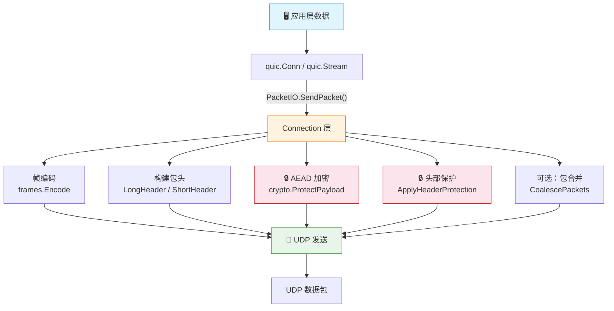

# 🚀 QUIC 传输协议 - Go 实现

> RFC 9000 · RFC 9001 · RFC 9002 — 纯 Go 从零实现的 QUIC，面向学习与教学。

**[English](README.md)** | **[中文](README.zh-CN.md)**


-success)


本项目按 [RFC 9000](https://www.rfc-editor.org/rfc/rfc9000)（传输）、[RFC 9001](https://www.rfc-editor.org/rfc/rfc9001)（用 TLS 保护 QUIC）、[RFC 9002](https://www.rfc-editor.org/rfc/rfc9002)（丢包检测与拥塞控制）规范，用 Go 实现了 QUIC 传输协议的核心，并提供一套用于构建服务端与客户端的高层 `quic` 包。

## 📋 概览

本项目实现了 QUIC 传输协议的基础构建模块，包括：

- **变长整数编码**（§16）—— QUIC 自定义 varint 格式（6/14/30/62 位）
- **包号编码/解码**（§17.1）—— 截断包号编码，遵循附录 A 伪代码
- **帧类型**（§19）—— RFC 9000 §19 定义的全部帧类型（0x00–0x1e）：PADDING、PING、ACK（含 ECN 变体）、RESET_STREAM、STOP_SENDING、CRYPTO、NEW_TOKEN、STREAM（0x08–0x0f）、MAX_DATA、MAX_STREAM_DATA、MAX_STREAMS（双向/单向）、DATA_BLOCKED、STREAM_DATA_BLOCKED、STREAMS_BLOCKED（双向/单向）、NEW_CONNECTION_ID、RETIRE_CONNECTION_ID、PATH_CHALLENGE、PATH_RESPONSE、CONNECTION_CLOSE（传输层/应用层）、HANDSHAKE_DONE
- **包头**（§17）—— 长头（Initial、0-RTT、Handshake、Retry）、短头（1-RTT）及版本协商
- **传输参数**（§18）—— 全部 17 个传输参数的编解码
- **连接 ID 管理**（§5.1）—— CID 生成、退役与无状态重置令牌
- **流管理**（§2-4）—— 双向/单向流、流状态机、流控
- **错误码**（§20）—— 全部传输错误码
- **连接状态机**（§5、§10）—— 生命周期、包路由、空闲超时、关闭/排空
- **ACK 跟踪**（§13）—— 已收包集合跟踪、ACK 区间生成
- **路径校验与迁移**（§8-9）—— PATH_CHALLENGE/RESPONSE、放大攻击防护
- **令牌管理**（§8）—— 地址校验令牌、Retry 完整性标签
- **包合并**（§12.4）—— 单 UDP 数据报多包合并/拆分
- **版本协商**（§6）—— VN 包生成与处理
- **PMTU 发现**（§14）—— DPLPMTUD 二分探测
- **包保护**（RFC 9001 §5）—— AEAD 加解密（AES-128-GCM、AES-256-GCM）、头部保护（AES-ECB 掩码）
- **密钥派生**（RFC 9001 §5.1-5.2）—— HKDF-Expand-Label、由 DCID 派生初始密钥、流量密钥/IV/HP 派生、密钥更新
- **TLS 1.3 集成**（RFC 9001 §4）—— CRYPTO 帧数据路由、加密级别管理、通过 Go crypto/tls QUICConn 跟踪握手状态
- **密钥更新与 Key Phase**（RFC 9001 §6）—— Key Phase 位翻转、旧密钥保留、AEAD 用量上限
- **RTT 估计**（RFC 9002 §5）—— smoothed_rtt、rttvar、min_rtt、ACK 延迟处理
- **丢包检测**（RFC 9002 §6）—— 包阈值（kPacketThreshold=3）、时间阈值（9/8 RTT）、PTO 计算与退避、多模丢包检测定时器
- **拥塞控制**（RFC 9002 §7）—— 类 NewReno：慢启动、拥塞避免、恢复期、ECN、持续拥塞

> HTTP/3 实现在独立的配套模块（`http3-go`）中，不在本仓内。HTTP/3 + QPACK 的 API 与 `cmd/demo` 请参见该模块的 README。

## 🛠️ API 用法

根目录 `quic` 包提供了一套仿照 Go 标准库 `net` 包设计的高层 API：

### 🖥️ 服务端

```go
listener, err := quic.Listen("udp", "127.0.0.1:4433", nil)
if err != nil {
    log.Fatal(err)
}
defer listener.Close()

for {
    conn, err := listener.Accept()
    if err != nil {
        log.Fatal(err)
    }
    go handleConn(conn)
}

func handleConn(conn *quic.Conn) {
    defer conn.Close()
    for {
        stream, err := conn.AcceptStream()
        if err != nil {
            return
        }
        go handleStream(stream)
    }
}
```

### 📡 客户端

```go
conn, err := quic.Dial("udp", "127.0.0.1:4433", nil)
if err != nil {
    log.Fatal(err)
}
defer conn.Close()

stream, err := conn.OpenStream()
if err != nil {
    log.Fatal(err)
}
stream.Write([]byte("Hello QUIC!"))

buf := make([]byte, 1024)
n, _ := stream.Read(buf)
fmt.Println(string(buf[:n]))
```

### ⚙️ 配置

```go
config := &quic.Config{
    MaxIdleTimeout:     30 * time.Second,
    MaxStreamData:      1 << 20,  // 每流 1 MiB
    MaxConnectionData:  10 << 20, // 每连接 10 MiB
    MaxStreamsBidi:     100,
    MaxStreamsUni:      100,
    ConnIDLength:       8,
}
```

## 🔐 TLS 快速上手

SDK 通过 `Config.TLSMode` 支持完整的 TLS 1.3 加密（RFC 9001）。本节涵盖从运行内置 demo 到自写 TLS 服务端/客户端的全部内容。

### ✅ 环境要求

- Go 1.26+（使用 `crypto/tls` 的 QUICConn API）
- 无外部依赖（仅 Go 标准库）

### ▶️ 运行 Demo

项目内置了一个 TLS echo demo（`cmd/tls-demo/`），自动在内存中生成自签名证书并完成 TLS 握手：

```bash
# 终端 1：启动 TLS 服务端
cd quic-go && go run ./cmd/tls-demo -server -addr 127.0.0.1:8443

# 终端 2：运行 TLS 客户端
cd quic-go && go run ./cmd/tls-demo -addr 127.0.0.1:8443
```

预期输出：

```
# 服务端
QUIC TLS server listening on 127.0.0.1:8443
TLS 1.3 + QUIC packet protection enabled
Waiting for connections...
connection from 127.0.0.1:xxxxx
server received: "hello over QUIC+TLS"

# 客户端
Dialing 127.0.0.1:8443 with QUIC+TLS...
TLS handshake complete, connection established
client sending: "hello over QUIC+TLS"
client received: "echo: hello over QUIC+TLS"
Demo complete!
```

### 📖 TLS 模式 API 概览

SDK 的 API 与 Go 标准 `net` 包一致——只需在 `Config` 中设置 `TLSMode: true` 即可启用 TLS：

```go
import "github.com/Cabbage4/quic-go"

config := &quic.Config{
    TLSMode:           true,              // 启用 TLS 1.3
    TLSCertificates:   []tls.Certificate{cert},  // 服务端证书（客户端不需要）
    ServerName:        "example.com",     // 客户端 SNI（仅客户端）
    InsecureSkipVerify: false,            // 客户端是否跳过证书验证
    ALPNProtocols:     []string{"h3"},    // ALPN 协议列表

    // 通用配置
    MaxIdleTimeout:    30 * time.Second,
    MaxStreamData:     1 << 20,   // 1 MiB
    MaxConnectionData: 10 << 20,  // 10 MiB
    MaxStreamsBidi:    100,
    MaxStreamsUni:     100,
    ConnIDLength:      8,
}
```

#### Config 中 TLS 相关字段

| 字段 | 类型 | 服务端 | 客户端 | 说明 |
|------|------|--------|--------|------|
| `TLSMode` | `bool` | 必填 | 必填 | `true` 启用 TLS 1.3；`false` 使用明文模式 |
| `TLSCertificates` | `[]tls.Certificate` | 必填 | 不需要 | 服务端 TLS 证书 |
| `ALPNProtocols` | `[]string` | 可选 | 可选 | ALPN 协商列表 |
| `ServerName` | `string` | 不需要 | 可选 | 客户端 SNI（应匹配证书主机名） |
| `InsecureSkipVerify` | `bool` | 不需要 | 可选 | 跳过证书验证（仅测试用） |

### 🖥️ 服务端用法

```go
package main

import (
    "crypto/tls"
    "log"
    "time"

    "github.com/Cabbage4/quic-go"
)

func main() {
    // 加载证书（生产环境从文件加载）
    cert, err := tls.LoadX509KeyPair("server.crt", "server.key")
    if err != nil {
        log.Fatal(err)
    }

    config := &quic.Config{
        TLSMode:         true,
        TLSCertificates: []tls.Certificate{cert},
        ALPNProtocols:   []string{"myapp"},
        MaxIdleTimeout:  30 * time.Second,
        ConnIDLength:    8,
    }

    listener, err := quic.Listen("udp", "0.0.0.0:443", config)
    if err != nil {
        log.Fatal(err)
    }
    defer listener.Close()

    for {
        conn, err := listener.Accept()
        if err != nil {
            log.Println(err)
            continue
        }
        go handleConnection(conn)
    }
}

func handleConnection(conn *quic.Conn) {
    defer conn.Close()
    for {
        stream, err := conn.AcceptStream()
        if err != nil {
            return
        }
        go handleStream(stream)
    }
}

func handleStream(stream *quic.Stream) {
    defer stream.Close()
    buf := make([]byte, 4096)
    for {
        n, err := stream.Read(buf)
        if err != nil {
            return
        }
        stream.Write(buf[:n]) // 回显
    }
}
```

### 📡 客户端用法

```go
package main

import (
    "log"
    "time"

    "github.com/Cabbage4/quic-go"
)

func main() {
    config := &quic.Config{
        TLSMode:            true,
        ServerName:         "example.com",
        ALPNProtocols:      []string{"myapp"},
        MaxIdleTimeout:     30 * time.Second,
        ConnIDLength:       8,
        InsecureSkipVerify: true, // 测试时跳过证书验证；生产环境应配置 RootCAs
    }

    conn, err := quic.Dial("udp", "example.com:443", config)
    if err != nil {
        log.Fatal(err)
    }
    defer conn.Close()

    // TLS 握手在 Dial 时自动驱动完成
    // 打开双向流并发送数据
    stream, err := conn.OpenStream()
    if err != nil {
        log.Fatal(err)
    }
    defer stream.Close()

    stream.Write([]byte("hello QUIC+TLS"))

    buf := make([]byte, 4096)
    n, _ := stream.Read(buf)
    log.Printf("received: %s", buf[:n])
}
```

### 🔓 明文模式（调试用）

将 `TLSMode` 设为 `false`（或不设置）即使用明文模式，数据包不加密——适用于协议学习和调试：

```go
config := &quic.Config{
    // TLSMode: false（默认值，无需显式设置）
    MaxIdleTimeout: 30 * time.Second,
    ConnIDLength:   8,
}

// 服务端
listener, _ := quic.Listen("udp", "127.0.0.1:8443", config)

// 客户端
conn, _ := quic.Dial("udp", "127.0.0.1:8443", config)
```

### 🔄 TLS 模式 vs 明文模式

| 特性 | 明文模式（`TLSMode: false`） | TLS 模式（`TLSMode: true`） |
|------|-----|-----|
| 数据加密 | 无 | AES-128-GCM / AES-256-GCM |
| 头部保护 | 无 | AES-ECB 掩码（RFC 9001 §5.4） |
| 握手 | PING → HANDSHAKE_DONE（简化） | TLS 1.3 ClientHello → ServerHello → Finished |
| 证书 | 不需要 | 需要（服务端必须；客户端可选 mTLS） |
| 传输参数 | 通过 Initial 帧交换 | 通过 TLS 扩展交换 |
| 密钥更新 | 不支持 | 支持（RFC 9001 §6 Key Update） |
| 适用场景 | 开发调试、协议学习 | 生产环境、安全通信 |

## 🏗️ 架构说明

TLS 模式下数据流经以下管道：



<details>
<summary>📄 文字版</summary>

```
应用层数据
    ↓
quic.Conn / quic.Stream
    ↓ 调用 PacketIO.SendPacket()
Connection 层
    ├── 帧编码 (frames.Encode)
    ├── 构建包头 (header.LongHeader / ShortHeader)
    ├── AEAD 加密 (crypto.ProtectPayload)
    ├── 头部保护 (crypto.ApplyHeaderProtection)
    ├── 可选：包合并 (coalesce.CoalescePackets)
    └── UDP 发送
    ↓
UDP 数据包
```

</details>

握手流程：

```
客户端                                     服务端
  │                                          │
  ├── Initial [CRYPTO: ClientHello] ────────→│
  │                                          │ (DeriveInitialKeys)
  │                                          │ (StartTLS → 处理 ClientHello)
  │←─── Initial [CRYPTO: ServerHello] ───────┤
  │←─── Handshake [CRYPTO: Cert, Finished] ──┤
  │                                          │
  │ (处理 ServerHello)                       │
  │ (安装 Handshake 密钥)                    │
  │                                          │
  ├── Handshake [CRYPTO: Finished] ────────→│
  │                                          │ (握手确认)
  │←──── 1-RTT [HANDSHAKE_DONE] ─────────────┤
  │                                          │
  │     连接建立，可传应用数据
  ├── 1-RTT [STREAM: data] ────────────────→│
  │←─── 1-RTT [STREAM: response] ───────────┤
```

关键组件：

- **`crypto.TLSSession`** —— 封装 `crypto/tls.QUICConn`，驱动 TLS 事件循环。
- **`connection.KeySetStore`** —— 管理各加密级别的密钥（Initial / Handshake / Application）。
- **`connection.PacketIO`** —— 统一收发管道；根据 `plaintextMode` 自动切换加密/明文路径。
- **`connection.Coordinator`** —— 生命周期协调器：驱动 TLS 握手、PN 空间丢弃、密钥更新。
- **`connection.FrameHandler`** —— 帧分发器；将 CRYPTO 帧路由到 `KeyStore.FeedCryptoData()`。

## 📁 项目结构

```
quic-go/
├── go.mod
├── varint/           # 变长整数编码（§16）
├── packet/           # 包号编解码（§17.1）
├── frames/           # 帧类型编解码（§19）
├── header/           # 包头格式（§17）
├── transport/        # 传输参数（§18）
├── connection/       # 连接生命周期与 CID 管理（§5、§10）
│   ├── conn.go            # 状态机、包路由、空闲超时、关闭/排空
│   ├── connid.go          # 连接 ID 管理（§5.1）
│   ├── crypto.go          # 各级别密钥库 + 包保护管道（RFC 9001）
│   ├── recovery.go        # 丢包检测 + 拥塞控制集成（RFC 9002）
│   ├── ack_handler.go     # 各 PN 空间 ACK 跟踪集成（§13）
│   ├── frame_handler.go   # 全帧处理分发（§19）
│   ├── packet_io.go       # 带保护的统一收发管道
│   ├── coordinator.go     # 生命周期协调器（握手、密钥丢弃、关闭）
│   ├── integration_test.go # 集成测试
│   └── e2e_test.go        # 端到端生命周期测试
├── stream/           # 流管理与流控（§2-4）
├── errors/           # 错误码（§20）
├── ack/              # ACK 跟踪与生成（§13）
├── path/             # 路径校验与迁移（§8-9）
├── token/            # 地址校验令牌（§8）
├── coalesce/         # 包合并（§12.4）
├── version/          # 版本协商（§6）
├── pmtu/             # PMTU 发现（§14）
├── crypto/           # 包保护与 TLS 集成（RFC 9001）
│   ├── keys.go       # HKDF-Expand-Label、初始密钥、流量密钥派生
│   ├── aead.go       # AEAD 加解密（AES-128-GCM、AES-256-GCM）
│   ├── header_protection.go  # 头部保护掩码生成与应用
│   ├── key_update.go # 密钥更新与 Key Phase 管理
│   ├── tls.go        # 经 crypto/tls QUICConn 的 TLS 1.3 集成
│   └── crypto_test.go # 测试
├── recovery/         # 丢包检测与拥塞控制（RFC 9002）
│   ├── loss_detection.go  # RTT 估计、PTO、丢包检测算法
│   ├── congestion.go      # 类 NewReno 拥塞控制
│   └── recovery_test.go   # 测试
# 高层 QUIC API（根目录包，原 sdk/）
│   ├── config.go     # Config、Listener、Conn、Stream 类型


├── cmd/
│   ├── demo/         # 协议级交互 demo
│   ├── echo/         # SDK echo 服务端/客户端示例
│   └── tls-demo/     # SDK TLS echo demo（自签名证书、AEAD 加密）
└── README.md
```

## ▶️ 运行

```bash
# 运行全部测试
cd quic-go && go test ./...

# 运行 SDK echo demo（终端 1 — 服务端）
cd quic-go && go run ./cmd/echo -server -addr 127.0.0.1:4433

# 运行 SDK echo demo（终端 2 — 客户端）
cd quic-go && go run ./cmd/echo -addr 127.0.0.1:4433 -msg "Hello QUIC!"

# 运行 TLS echo demo（终端 1 — 服务端）
cd quic-go && go run ./cmd/tls-demo -server -addr 127.0.0.1:8443

# 运行 TLS echo demo（终端 2 — 客户端）
cd quic-go && go run ./cmd/tls-demo -addr 127.0.0.1:8443

# 运行协议 demo
cd quic-go && go run ./cmd/demo
```

## 🎯 关键设计决策

1. **纯 Go** —— 无外部依赖（仅标准库）。
2. **RFC 9000 附录 A 伪代码** —— 包号编解码算法直接实现附录 A.2 与 A.3 的伪代码。
3. **网络字节序** —— 所有多字节整数使用大端编码。
4. **测试向量** —— 使用 RFC 9000 测试向量校验（如 varint 0x25=37、0x7bbd=15293）。
5. **SDK 复用 connection 层管道** —— SDK 的 `Conn` 通过 `initSubsystems()` 把 connection 层各子系统串联起来：KeySetStore、AckHandler、RecoveryManager、stream.Manager、FrameHandler、PacketIO。SDK 的 `handleIncoming` 经 `FrameHandler.ProcessFrames()`（用 `frames.Decode()` 解析 RFC 9000 §19 全部帧类型）分发入包载荷，而非内联解析。`Coordinator` 统一编排生命周期过渡（握手、PN 空间丢弃、Key Phase、带排空的连接关闭）。

6. **Connection 层集成** —— `connection/` 包提供完整集成层，串联 crypto、recovery、ACK 跟踪、帧处理、包 I/O 与生命周期协调：
   - `crypto.go`：KeySetStore 管理各级别密钥、包保护管道（AEAD + 头部保护）、TLS 会话管理
   - `recovery.go`：RecoveryManager 集成丢包检测 + 拥塞控制，挂接收发钩子
   - `ack_handler.go`：各 PN 空间 ACK 跟踪器，含 ACK 帧生成与解析
   - `frame_handler.go`：用 `frames.Decode()` 全量分发 RFC 9000 §19 帧类型，PATH_CHALLENGE/RESPONSE 排队、RETIRE_CONNECTION_ID 处理、已发帧跟踪（ACK 驱动流状态更新）
   - `packet_io.go`：带保护的统一收发管道，含合并、PN 截断/重建、Key Phase 位接线、已发帧记录
   - `coordinator.go`：中央生命周期协调器 —— 握手驱动、PN 空间丢弃协调（RFC 9001 §4.9）、Key Phase 管理（RFC 9001 §6）、带排空的连接关闭（RFC 9000 §10.2-10.3）
   - `e2e_test.go`：覆盖完整连接生命周期的端到端集成测试

## 📊 状态

| 指标 | 值 |
|---|---|
| Go 文件 | 54 |
| 测试函数 | 219 ✅ |
| 包 | 17 |
| 外部依赖 | 0（仅标准库） |

| 组件 | 状态 |
|---|---|
| RFC 9000（传输） |  |
| RFC 9001（TLS 集成） |  |
| RFC 9002（丢包检测与拥塞控制） |  |
| Connection 层集成 |  |
| `quic` 包 API |  |
| TLS 模式（`Config.TLSMode=true`） |  |

- RFC 9001：密钥派生、AEAD、头部保护、密钥更新、经 crypto/tls QUICConn 的 TLS 握手
- RFC 9002：RTT 估计、PTO、丢包检测、NewReno 拥塞控制
- Connection 层：crypto、recovery、ACK、frame handler、packet I/O、coordinator、e2e 测试
- **TLS 模式：`Config.TLSMode=true` 启用完整 TLS 1.3 + AEAD 包保护**。见 [TLS 快速上手](#-tls-快速上手) 及 `cmd/tls-demo/`。

## ⚡ 性能

本仓是从零开始、面向学习与教学的实现。下列数据均在回环（`127.0.0.1`）上取得，反映的是纯协议栈开销、不含网络 RTT。在修复了主要的 O(N²)（已关闭的流从不从连接级流 map 退役，导致每个收包的投递循环都要遍历一个随请求数增长的集合）之后，请求速率吞吐已随 N 线性扩展。

### 📐 方法

- **请求速率**：单 QUIC 连接、串行（同一时刻只有一个在途请求）GET 请求、极小负载（约几十字节）、明文路径（`TLSMode: false`），经 `http3-go` 配套 demo（依赖本 `quic-go` SDK）运行：`go run ./cmd/demo -server -addr 127.0.0.1:端口` 与 `go run ./cmd/demo -addr 127.0.0.1:端口 -n N`。
- **大块传输**：经 `cmd/echo` 在一条双向流上回显 8 MiB。

### 📈 结果 —— 请求速率（单连接、回环、全部优化后）

| 请求数 N | 总耗时 | 吞吐 | 每请求延迟 |
|---:|---:|---:|---:|
| 300    | 0.105 s | ~2,860 req/s | 0.35 ms |
| 1,000  | 0.196 s | ~5,100 req/s | 0.20 ms |
| 3,000  | 0.810 s | ~3,700 req/s | 0.27 ms |
| 10,000 | 1.875 s | ~5,320 req/s | 0.19 ms |

每请求延迟现已与 N 无关、约恒定（~0.20 ms）——线性可扩展性。N=1,000 处相比优化前基线提升约 **40×**（8.0 s → 0.20 s）。

### 🔧 做了哪些优化

1. **流退役（主修复）**。`Conn.deliverReceivedStreamData` 每个收包都执行，遍历 `c.streams`（以及 `Manager.AllStreams()`）；而 `Manager.CloseStream` 虽存在但**零调用者**，每个已关闭的流都永久留在这些 map 里 → 每包 O(N²) 扫描。现已在该循环中把完全关闭的流（`eofSent && writeClosed`）从 `c.streams` 与 stream `Manager` 两处一并退役。
2. **ACK 增量去重**。ACK 帧是累计的，每个 ACK 都重新描述全部已确认集合，接收方每次都重新物化/扫描 → 每个 ACK 一次 O(N)、全程 O(N²)。`AckHandler.NewlyAckedFromFrame` 现在只返回**新**确认的包号（用每空间高水位跳过已上报前缀），使已发帧跟踪与丢包检测每个 ACK 只做 O(增量) 工作。
3. **`Stream.Write` 分片**。`Stream.Write` 此前把整个 buffer 作为单个 STREAM 帧塞进一个超限 UDP 数据报（被内核丢弃）。现已分片为 ≤1100 字节的 STREAM 帧。
4. **per-connection goroutine 接收模型**。原单 `recvLoop` 对所有连接同步调 `handleIncoming`（串行化）；现每 `Conn` 有独立 `connRecvLoop` goroutine + `recvCh`，连接间并行。
5. **发送 pacing**。`sendLoop` 按 `cwnd / srtt` token-bucket 限速（clamp [1µs, 5ms]），避免 burst；真实网络减少丢包。
6. **延迟 ACK（频率=2）**。ACK 频率原为 1（~10 个 ACK 包/请求）。现每 2 个 ack-eliciting 包发一个 ACK（RFC 9000 §13.2.1），ACK 包数减半——**请求速率 +21%**（n=1000: 329ms → 272ms）。
7. **复用 64KB 投递缓冲**。`deliverReceivedStreamData` 此前每包每流 `make([]byte, 65536)`——64KB alloc × 每包，万包级 stress ~640MB 垃圾。改为 per-Conn 固定数组 `Conn.deliverBuf [65536]byte`，消除该 alloc——**请求速率 +39%**。

### ⚠️ 仍存在的限制

- **大块传输：~80% 成功，~44 MiB/s。** 之前的"flaky 卡顿"很大程度是 bench 的 artifact：测试写完数据但不发 FIN，服务端 echo `Read` 永远收不到 EOF、无限等待。`Stream.Close()` 在 `Write` 后发 FIN，4 MiB echo 约 180ms（~44 MiB/s / ~350 Mbit/s）完成，约 8/10 成功。剩余 ~20% 卡顿是残留竞态（可能 Close 与最后一段 Write 的 sendQueue flush 竞态）。SDK 侧修复（非阻塞 readCh + PushBack + 删 O(N log N) loss-detection sort）正确、保留。（请求速率不受影响：~3060 req/s。）
- **ACK 频率实际为 1**：每收一个 ack-eliciting 包就单独回一个 ACK 包（无合并、无延迟 ACK）；每个请求在链路上仍约 ~10 个包。
- 类 NewReno 拥塞控制，无 pacing。

### 🎓 结论

吞吐仍远低于生产级栈（参考 [quic-go](https://github.com/quic-go/quic-go) 可达多 Gbit/s、数万 req/s），对一个单文件单职责的学习实现属预期。按优先级，剩余提升空间最大的是：

1. **修复剩余 ~20% bulk 卡顿** —— bulk 现 ~80% 成功 @ ~44 MiB/s（FIN-after-Write 修复了主要卡顿）；剩余 ~20% 疑为 Close 与 Write flush 竞态。
2. **ACK 合并 / 延迟 ACK** —— 把每请求 ~10 个包降到 ~2-3。
3. Pacing 与更现代的拥塞控制（如 BBR）。

生产级 Go QUIC 实现可参考 [quic-go](https://github.com/quic-go/quic-go)。
